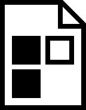

# KVP
A simple key value pair data format
## Implementations
The standard implementation is avalible in several different languages and should work identically.
Supported Languages:
+ [JavaScript](https://github.com/SteveBeeblebrox/KVP/tree/master/Standard/javascript)
  + Normal
  + Module
+ [Java 8+](https://github.com/SteveBeeblebrox/KVP/tree/master/Standard/java)
## Extensions
Extension do not follow a standard and may work differnetly or only be avalible in some languages.
### JavaScript Object Builder
Supported Languages:
+ [JavaScript](https://github.com/SteveBeeblebrox/KVP/tree/master/Extensions/javascript)
  + Normal
  + Module  
  
This extension adds support for quickly building ojects from a template and a KVP object or string. It adds the class `KVPObjectBuilder` which supports all the static and instance methods of the standard KVP class in addition to the new `build` function.  
There are three different ways to use the `build` function:
  ```javascript
  KVPObjectBuilder.build(srcString, pattern)
  ```

  ```javascript
  new KVPObjectBuilder(srcString).build(pattern)
  ```

  ```javascript
  KVPObjectBuilder.parse(srcString).build(pattern)
  ```
A pattern object is just a JavaScript object where the keys should match the desired KVP keys and the values are a function telling the builder what data type to convert the values into:
```javascript
let {getString, getBoolean, getInteger, getDecimal, getDate} = KVPObjectBuilder;
let pattern = {
    name: getString(),
    age: getInteger(),
    birthday: getDate(),
    'is admin': getBoolean()
}
```
## Format
+ Single Line Comments
  + Anything following a `!` is ignored
+ Key Value Pairs
  + Pairs are defined on their own line and follow the pattern `key: value`
  + Keys and values can contain any character except `:`, `!`, `"`, or `'`
  + Whitespace is trimmed from values so `key: value` and `key:value` both have a value of just `value`
  + To keep leading or trailing whitepace, wrap the value in single or double quotes (`key:" value "` or `key:' value '`)
+ Escaping Characters
  + The following characters may be escaped when needed: `$`, `!`, `:`, `"`, `'`, and `\n`
  + For `$`, `!`, `:`, `"`, or `'`, simply type a `$` before the character to be escaped
  + To escape a newline (`\n`), use `$endline` instead
  + Characters in keys and values can be escaped; however, not all occurrences of special characters need to be escaped
    + Any `:` in the value do not need to be escaped
    + Quotes in the key do not need to be escaped
## Miscellaneous
### Images
There are several images inside of the `assets` folder that can be used for file icons or other references to KVP parsing or support within a program.
